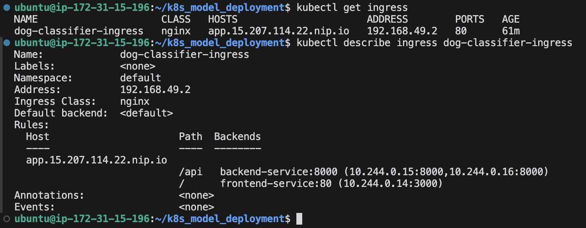

# Kubernetes FastAPI Deployment Project 🚀

 
 
 


## 🌟 Project Overview

This project demonstrates how to deploy a **FastAPI** application using **Kubernetes** with **Minikube**. The application includes image classification capabilities powered by an **ONNX** model. The deployment consists of a backend service, a frontend interface, and the necessary Kubernetes configurations to orchestrate the deployment.

## 🛠️ Components

1. **Backend**: 
   - **Technology**: FastAPI
   - **Purpose**: Serves an ONNX model for image classification
   - **Image**: `backend:latest`
   
2. **Frontend**: 
   - **Technology**: FastHTML
   - **Purpose**: Provides a user interface for image classification
   - **Image**: `frontend:latest`
   
3. **Kubernetes**: 
   - **Tool**: Minikube
   - **Purpose**: Orchestrates the deployment of the backend and frontend services

## ⚙️ Prerequisites

- **Docker**: Ensure Docker is installed and running.
- **Minikube**: Install Minikube for local Kubernetes cluster setup.
- **kubectl**: Kubernetes command-line tool installed.
- **Python 3.8+**: Required for FastAPI backend.

## 🚀 Installation & Deployment

1. **Start Minikube Cluster**
   ```bash
   minikube start
   ```

2. **Build Docker Images**
   ```bash
   docker build -t backend:latest ./backend
   docker build -t frontend:latest ./frontend
   ```

3. **Deploy Backend**
   ```bash
   kubectl apply -f deployment/backend/be_deployment.yaml
   ```

4. **Deploy Frontend**
   ```bash
   kubectl apply -f deployment/frontend/fe_deployment.yaml
   ```

5. **Set Up Ingress Controller**
   ```bash
   kubectl apply -f deployment/ingress_controller/ingress.yaml
   ```

6. **Expose Ingress**
   ```bash
   minikube tunnel
   ```

## 📋 Available Commands

- **List All Resources**
  ```bash
  kubectl get all
  ```
  

- **View Ingress Resources**
  ```bash
  kubectl get ingress
  ```
  
  
- **Describe Ingress**
  ```bash
  kubectl describe ingress
  ```
  

- **Describe Services**
  ```bash
  kubectl describe service frontend-service
  kubectl describe service backend-service
  ```
  
  

- **Describe Deployments**
  ```bash
  kubectl describe deployment frontend-deployment
  kubectl describe deployment backend-deployment
  ```
  
  

- **Describe Pods**
  ```bash
  kubectl describe pod frontend-deployment-XXXXXXX-XXXX
  kubectl describe pod backend-deployment-XXXXXXX-XXXX
  ```
  
  

- **Monitor Resources**
  ```bash
  kubectl top pod
  kubectl top nodes
  ```
  
  

- **Get Detailed YAML of All Resources**
  ```bash
  kubectl get all -o yaml
  ```
  [Output](all_output.yaml)

## 📈 Output Monitoring

After deployment, you can monitor the status of your Kubernetes resources using the above commands. Ensure that all pods are running and services are properly exposed via the ingress controller.

FastAPI Docs:


Frontend:


## 🖥️ Accessing the Application

Once deployed, access the frontend application through the URL provided by the ingress controller. This interface allows users to upload images for classification, leveraging the backend FastAPI service.

## 🧩 Technologies Used

- **FastAPI**: High-performance web framework for building APIs with Python.
- **ONNX**: Open Neural Network Exchange format for deploying models.
- **Docker**: Containerization platform to package applications.
- **Kubernetes**: Orchestration system for automating deployment, scaling, and management of containerized applications.
- **Minikube**: Local Kubernetes environment for development and testing.
- **FastHTML**: Lightweight frontend framework for building user interfaces.    

---
*Happy Deploying! 🎉*
